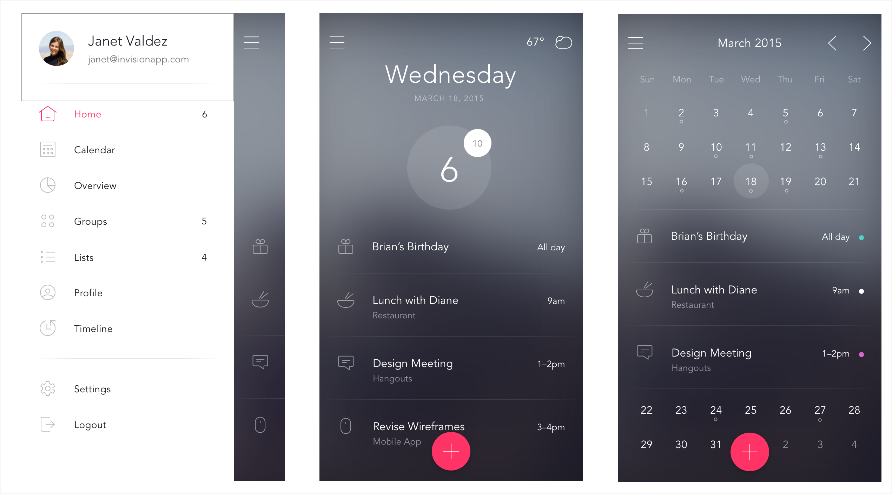

# DO
Open-Source ToDo App inspired by [DO UI Kit by Invision][].

# Requirements

- Xcode 6.3
- iOS 8
- Swift 2.0

# Credits

- [SWRevealViewController][] for side navigation.
- [CVCalendar][] for displaying calenadar.

[SWRevealViewController]:https://github.com/John-Lluch/SWRevealViewController
[CVCalendar]:https://github.com/Mozharovsky/CVCalendar
[DO UI Kit by Invision]:http://www.invisionapp.com/do
